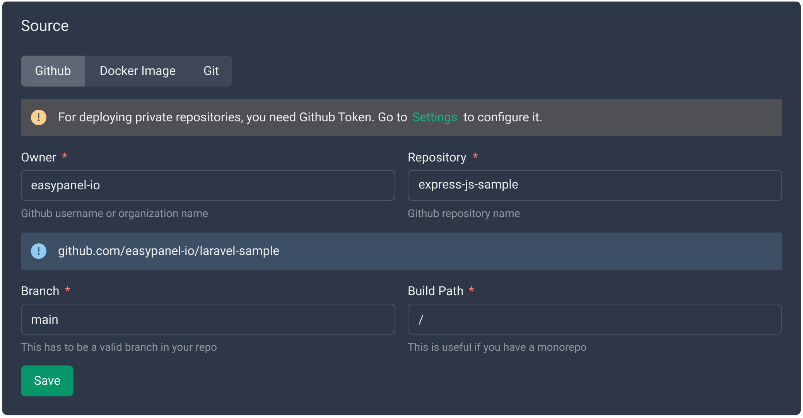

# Express.js

Express.js is a popular web application framework built with Node.js, providing a minimalist and flexible approach for developing web applications. Easypanel is a user-friendly web hosting control panel that simplifies server management, including the deployment and configuration of web applications. This guide will take you through the process of deploying an Express.js application on Easypanel, making it accessible via a public URL.

## Prerequisites

Before you begin, make sure you have the following:

- An operational Express.js application on your local machine ([sample codebase](https://github.com/easypanel-io/express-js-sample)).
- Easypanel installed and running on your server.

## Step 1 - Creating a New Project on Easypanel

1. Log in to your Easypanel account.
2. Click on the "New" button to create a new project.
3. Provide a name for your project.
4. Click on "Create" to complete the project creation process.

## Step 2 - Setting up Your Application Service

After creating the project, proceed with setting up your application service, which represents your Express.js application:

1. Within the project dashboard, click on "+ Service."
2. Select "App" as the service type.

## Step 3 - Configuring the Git/GitHub Source

If you plan to deploy your Express.js application from a repository, configure the Git repository source in Easypanel:

## Step 4 - Choosing the Build Method

We suggest one of thexe two methods to deploy your Express.js application:

- Nixpacks: A package manager that simplifies building Node.js applications. You can use Nixpacks to define the environment for your Express.js application and build it automatically.
- Dockerfile: Docker is a containerization technology that allows you to package your Express.js application with its dependencies and deploy it as a container. You can use Dockerfile to define the environment for your Express.js application and build it automatically.

To select your build method:

1. Go to the "Build" tab within your application service.
2. Choose either Nixpacks or Dockerfile based on your preferences and requirements.
3. Configure the selected method as needed.
4. Save your changes, and a prompt to "Deploy" will appear.
5. Click on "Deploy" to initiate the deployment process.

If you are going to deploy your app using a Dockerfile you will have to specify the relative path to the Dockerfile inside your repository.

## Step 5 - Setting up Your Environment

Configure the environment variables required for your Express.js application using Easypanel's "Environment" tab:

1. Navigate to the "Environment" tab within your application service.
2. Define the necessary key-value pairs for your environment variables.
3. Save the changes to apply the environment configurations.
4. Press "Deploy" to ensure the changes take effect in your running application.

## Step 6 - Accessing and Testing Your Application

Once the deployment is complete, your Express.js application will be accessible through the public URL generated by Easypanel.

## Conclusion

Easypanel simplifies the process of deploying web applications, making it an ideal hosting solution for your Express.js application. By following the steps outlined in this guide, you can successfully deploy your Express.js application on Easypanel and make it available through a public URL. Don't forget to regularly update and secure your application to ensure smooth and secure operations.

If you encounter any issues or have further questions, don't hesitate to refer to Easypanel's documentation or seek assistance from their support team. Happy hosting
