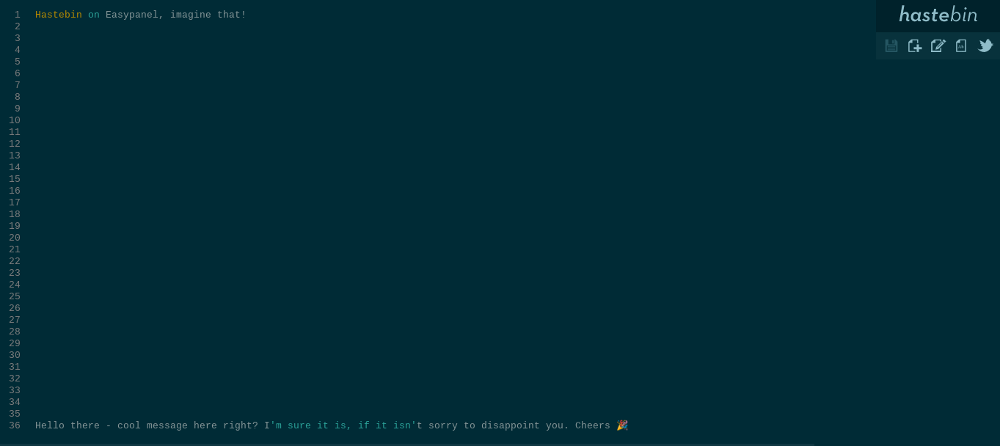

<!-- generated -->

# Hastebin

1-Click installation template for Hastebin on Easypanel

## Description

Haste is an open-source software that allows you to quickly and easily share text snippets. It&#39;s designed to be simple, pretty, and easy to use. With Haste, you can create a &#39;paste&#39; of your text and it will generate a unique URL that you can share. This is particularly useful for sharing code snippets or other information that you want to quickly share with others. Haste is written in node.js and can be backed by either a file system or redis, providing flexibility in how it&#39;s set up. It also includes a utility called haste-client that allows you to create pastes directly from your command line. Haste is designed to work well with a variety of browsers, including Firefox, Chrome, and Safari.

## Benefits

- Efficient Data Sharing: Haste allows users to share data quickly and efficiently. By simply inputting data into the app, users can generate a URL that can be shared with others. This eliminates the need for cumbersome email attachments or other more traditional methods of data sharing.
- Versatile Data Storage: Haste supports a variety of data storage options. Whether you prefer file storage, Redis, PostgreSQL, MongoDB, Memcached, RethinkDB, Google Datastore, or Amazon S3, Haste has you covered. This flexibility allows users to choose the storage option that best suits their needs.
- Simple and Elegant Design: Haste is designed to be simple and elegant. Its user-friendly interface makes it easy for anyone to use, regardless of their technical expertise. Plus, its sleek design makes it a pleasure to work with.

## Features

- Data Sharing: Haste makes it easy to share data. Simply input your data into the app, and Haste will generate a URL that you can share with others. This feature is perfect for those who need to share large amounts of data quickly and efficiently.
- Multiple Storage Options: Haste supports a variety of data storage options. You can choose to store your data in files, Redis, PostgreSQL, MongoDB, Memcached, RethinkDB, Google Datastore, or Amazon S3. This feature gives you the flexibility to choose the storage option that best suits your needs.
- Rate Limiting: Haste includes built-in rate limiting courtesy of connect-ratelimit. This feature helps to prevent abuse and ensure fair usage by limiting the number of requests a user can make within a certain timeframe.
- Key Generation: Haste includes a key generation feature that generates unique keys for each piece of data you input into the app. You can choose to generate phonetic keys, similar to pwgen, or random keys. This feature ensures that each piece of data you share has a unique identifier.

## Links

- [Documentation](https://github.com/toptal/haste-server/wiki)
- [Github](https://github.com/toptal/haste-server)
- [Template Source](https://github.com/easypanel-io/templates/tree/main/templates/hastebin)

## Options

Name | Description | Required | Default Value
-|-|-|-
App Service Name | - | yes | hastebin
App Service Image | - | yes | rlister/hastebin:latest

## Screenshots

## Change Log

- 2022-11-22 – first release

## Contributors

- [Supernova3339](https://github.com/Supernova3339)
