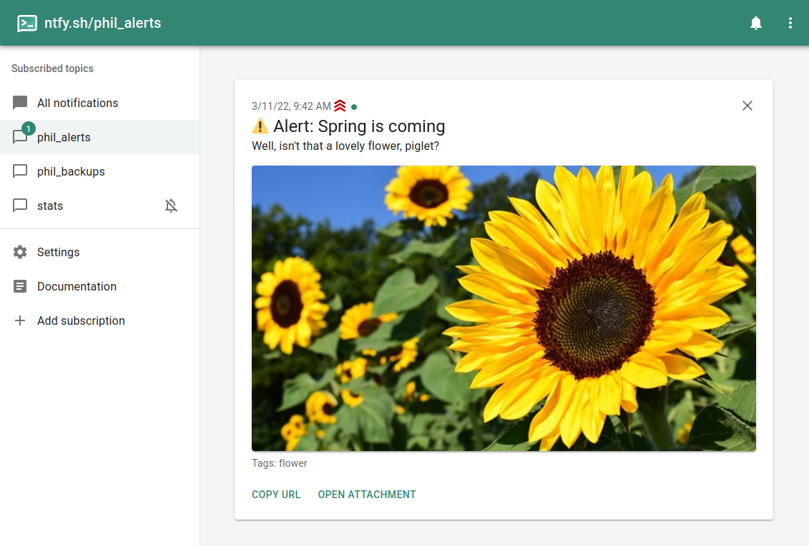

<!-- generated -->

# Ntfy

1-Click installation template for Ntfy on Easypanel

## Description

ntfy, pronounced as &#39;notify&#39;, is a simple, HTTP-based pub-sub notification service that allows you to send push notifications to your phone or desktop from any computer. It operates via scripts using simple HTTP PUT or POST requests. This makes it a handy tool for notifying yourself when scripts fail or when long-running commands complete. To use ntfy, you simply need to install the app on your phone, subscribe to a topic of your choice, and start sending messages to your topic. The app is available on Google Play, F-Droid, and the App Store. ntfy is open-source and free to use, but also offers paid plans for those who wish to support its development.

## Benefits

- Instant Notifications: With ntfy, you can receive instant push notifications on your phone or desktop. This can be particularly useful for keeping track of scripts or long-running commands, as you'll be notified immediately when they fail or complete.
- Easy to Use: ntfy is designed to be simple and straightforward to use. You can send notifications using simple HTTP PUT or POST requests, and there's no need to sign up or pay any fees.
- Open Source: ntfy is an open-source app, which means you can review its code, contribute to its development, or even run your own instance of the service if you wish.

## Features

- Push Notifications: ntfy allows you to send push notifications to your phone or desktop. You can use scripts from any computer to send these notifications, making it a versatile tool for a variety of use cases.
- Topic Subscription: With ntfy, you can subscribe to a topic of your choosing. Once you've subscribed, the app will listen for new messages on that topic and notify you when they arrive.
- Message Publishing: ntfy makes it easy to publish messages to your chosen topic. You can do this using HTTP PUT/POST requests, or with the ntfy CLI. The message is included in the request body.

## Links

- [Documentation](https://docs.ntfy.sh)
- [Github](https://github.com/binwiederhier/ntfy)
- [Template Source](https://github.com/easypanel-io/templates/tree/main/templates/ntfy)

## Options

Name | Description | Required | Default Value
-|-|-|-
App Service Name | - | yes | ntfy
App Service Image | - | yes | binwiederhier/ntfy:v2.11.0

## Screenshots

## Change Log

- 2022-11-21 – first release

## Contributors

- [Supernova3339](https://github.com/Supernova3339)
