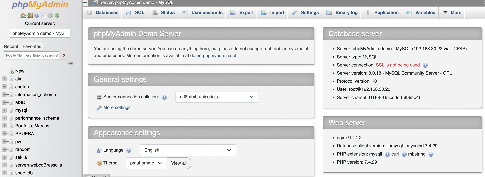

<!-- generated -->

# phpMyAdmin

1-Click installation template for phpMyAdmin on Easypanel

## Description

phpMyAdmin is a free software tool designed to manage MySQL over the web. This powerful tool supports a broad spectrum of operations on MySQL and MariaDB. It allows you to perform frequently used operations such as managing databases, tables, columns, relations, indexes, users, permissions, and more through its user-friendly interface. Additionally, it provides the flexibility to directly execute any SQL statement. phpMyAdmin also features an intuitive web interface and supports most MySQL features. You can browse and drop databases, tables, views, fields, and indexes; create, copy, drop, rename, and alter databases, tables, fields, and indexes; manage MySQL user accounts and privileges; and much more. It also allows you to import data from CSV and SQL, export data to various formats, administer multiple servers, create graphics of your database layout in various formats, and create complex queries using Query-by-example (QBE).

## Benefits

- Efficient MySQL Management: phpMyAdmin is a free software tool that allows you to handle the administration of MySQL over the web. It supports a wide range of operations on MySQL and MariaDB, making it a comprehensive tool for managing your databases.
- Intuitive User Interface: With phpMyAdmin, you can perform frequently used operations such as managing databases, tables, columns, relations, indexes, users, permissions, etc., via the user interface. It also allows you to directly execute any SQL statement.
- Multilingual Support: To cater to a wide range of users, phpMyAdmin is translated into 72 languages and supports both left-to-right and right-to-left languages.

## Features

- Wide Range of MySQL Operations: phpMyAdmin supports a wide range of operations on MySQL and MariaDB. You can browse and drop databases, tables, views, fields, and indexes; create, copy, drop, rename, and alter databases, tables, fields, and indexes; manage MySQL user accounts and privileges; and much more.
- Direct SQL Statement Execution: phpMyAdmin allows you to directly execute any SQL statement, providing you with the flexibility to perform complex operations.
- Data Import and Export: With phpMyAdmin, you can import data from CSV and SQL files and export data to various formats including CSV, SQL, XML, PDF, ISO/IEC 26300 - OpenDocument Text and Spreadsheet, Word, LATEX, and others.
- Complex Query Creation: phpMyAdmin enables you to create complex queries using Query-by-example (QBE), making it easier to search globally in a database or a subset of it.
- Data Transformation: phpMyAdmin allows you to transform stored data into any format using a set of predefined functions, like displaying BLOB-data as image or download-link.

## Links

- [Website](https://www.phpmyadmin.net/)
- [Documentation](https://www.phpmyadmin.net/docs/)
- [Github](https://github.com/phpmyadmin/phpmyadmin)
- [Template Source](https://github.com/easypanel-io/templates/tree/main/templates/phpmyadmin)

## Options

Name | Description | Required | Default Value
-|-|-|-
App Service Name | - | yes | phpmyadmin
App Service Image | - | yes | phpmyadmin:5.2.1

## Screenshots

## Change Log

- 2022-07-12 – first release

## Contributors

- [Andrei Canta](https://github.com/deiucanta)
